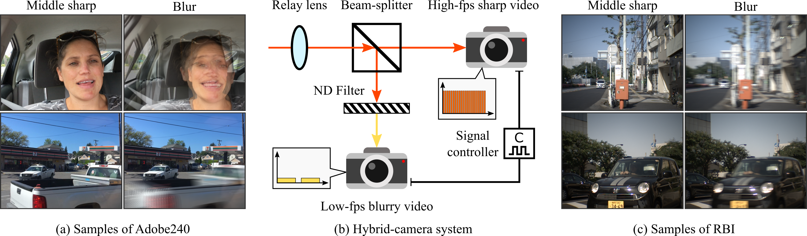

# BiT

#### :rocket: **[CVPR2023]** [Blur Interpolation Transformer for Real-World Motion from Blur](https://arxiv.org/abs/2211.11423)

by [Zhihang Zhong](https://zzh-tech.github.io/), Mingdeng Cao, Xiang Ji, Yinqiang Zheng, and Imari Sato

:point_right: [Project website](https://zzh-tech.github.io/BiT/)

Please leave a ⭐ if you like this project!

#### **TL;DR**:

Our proposed method, BiT, is a powerful transformer-based technique for arbitrary factor blur interpolation, which achieves state-of-the-art performance.


In addition, we present the first real-world dataset for benchmarking blur interpolation methods.



## Preparation

#### Download data
Please download the synthesized Adobe240 dataset from their original [repo](https://github.com/laomao0/BIN).

Our real-world dataset RBI can be downloaded from [here](https://drive.google.com/file/d/1RV2Fq6-jSb_B_7sCLIUd6-q12pRmyF0F/view?usp=share_link).

#### Download checkpoints

Please download the corresponding checkpoints from [here](https://drive.google.com/drive/folders/1eMsEKMkC2YiQ_RzSMGGExmvnDo9C04HO?usp=share_link).

#### Conda environment installation:

```shell
conda create -n BiT python=3.8
conda activate BiT
pip install torch==1.12.1+cu116 torchvision==0.13.1+cu116 torchaudio==0.12.1 --extra-index-url https://download.pytorch.org/whl/cu116
pip install -r requirements.txt
```

## Train

#### Train on Adobe240

Train BiT on Adobe240 (BiT+ is same as BiT but with more training epochs):

```shell
python -m torch.distributed.launch --nproc_per_node=8 train_bit.py --config ./configs/bit_adobe240.yaml
```

Train BiT++ on Adobe240 (P.S., need to load a pretrained BiT checkpoint. Please set the path of the checkpoint in the config file, *i.e.*, "./configs/bit++_adobe240.yaml"):

```shell
python -m torch.distributed.launch --nproc_per_node=8 train_bit.py --config ./configs/bit++_adobe240.yaml
```

#### Train on RBI

Train BiT on RBI:

```shell
python -m torch.distributed.launch --nproc_per_node=8 train_bit.py --config ./configs/bit_rbi.yaml
```

Train BiT++ on RBI (P.S., need to load a pretrained BiT checkpoint. Please set the path of the checkpoint in the config file, *i.e.*, "./configs/bit++_rbi.yaml"):

```shell
python -m torch.distributed.launch --nproc_per_node=8 train_bit.py --config ./configs/bit++_rbi.yaml
```

## Test

#### Test on Adobe240 

Test BiT++ on Adobe240:

```shell
CUDA_VISIBLE_DEVICES=0 ./tools/test/test_bit_adobe240.sh ./checkpoints/bit++_adobe240/cfg.yaml ./checkpoints/bit++_adobe240/latest.ckpt ./results/bit++_adobe240/ /home/zhong/Dataset/Adobe_240fps_dataset/Adobe_240fps_blur/
```

[Optional] Test BiT on Adobe240:

```shell
CUDA_VISIBLE_DEVICES=0 ./tools/test/test_bit_adobe240.sh ./checkpoints/bit_adobe240/cfg.yaml ./checkpoints/bit_adobe240/latest.ckpt ./results/bit_adobe240/ /home/zhong/Dataset/Adobe_240fps_dataset/Adobe_240fps_blur/
```

#### Test on RBI 

Test BiT++ on RBI:

```shell
CUDA_VISIBLE_DEVICES=0 ./tools/test/test_bit_rbi.sh ./checkpoints/bit++_rbi/cfg.yaml ./checkpoints/bit++_rbi/latest.ckpt ./results/bit++_rbi/
```

[Optional] Test BiT on RBI:

```shell
CUDA_VISIBLE_DEVICES=0 ./tools/test/test_bit_rbi.sh ./checkpoints/bit_rbi/cfg.yaml ./checkpoints/bit_rbi/latest.ckpt ./results/bit_rbi/
```

## Inference

Inference with BiT++:

```shell
sh ./tools/inference/inference.sh ./checkpoints/bit++_adobe240/cfg.yaml ./checkpoints/bit++_adobe240/latest.ckpt ./demo/00777.png ./demo/00785.png ./demo/00793.png ./demo/bit++_results/ 45
```

[Optional] Inference with BiT:

```shell
sh ./tools/inference/inference.sh ./checkpoints/bit_adobe240/cfg.yaml ./checkpoints/bit_adobe240/latest.ckpt ./demo/00777.png ./demo/00785.png ./demo/00793.png ./demo/bit_results/ 45
```

## Citation

If you find this repository useful, please consider citing:

```bibtex
@inproceedings{zhong2023blur,
  title={Blur Interpolation Transformer for Real-World Motion from Blur},
  author={Zhong, Zhihang and Cao, Mingdeng and Ji, Xiang and Zheng, Yinqiang and Sato, Imari},
  journal={Proceedings of the IEEE/CVF Conference on Computer Vision and Pattern Recognition},
  year={2023}
}
@inproceedings{zhong2022animation,
  title={Animation from blur: Multi-modal blur decomposition with motion guidance},
  author={Zhong, Zhihang and Sun, Xiao and Wu, Zhirong and Zheng, Yinqiang and Lin, Stephen and Sato, Imari},
  booktitle={Computer Vision--ECCV 2022: 17th European Conference, Tel Aviv, Israel, October 23--27, 2022, Proceedings, Part XIX},
  pages={599--615},
  year={2022},
  organization={Springer}
}
@article{zhong2022blur,
  title={Blur Interpolation Transformer for Real-World Motion from Blur},
  author={Zhong, Zhihang and Cao, Mingdeng and Ji, Xiang and Zheng, Yinqiang and Sato, Imari},
  journal={arXiv preprint arXiv:2211.11423},
  year={2022}
}
```
